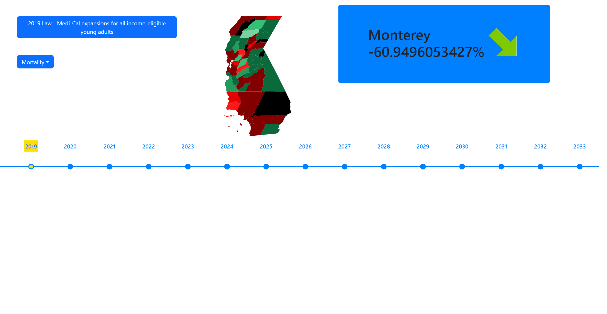
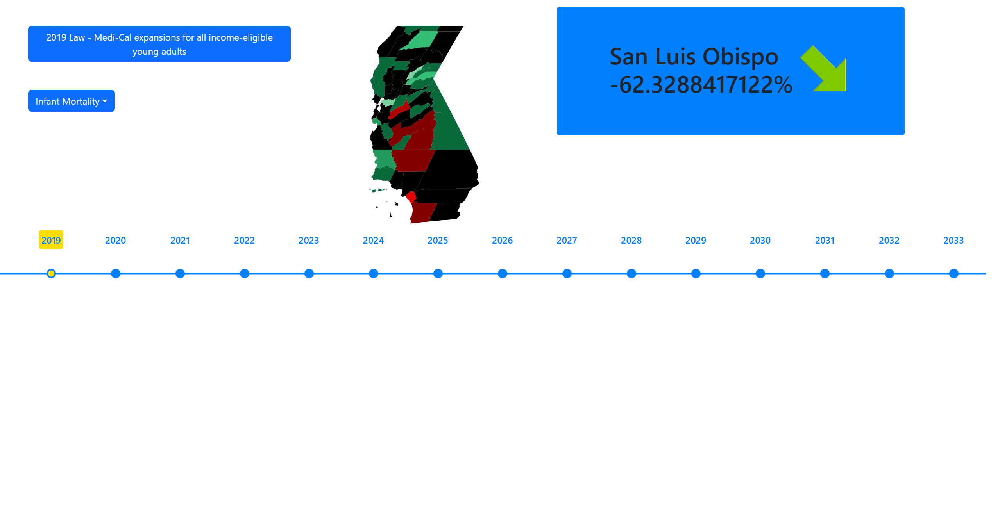
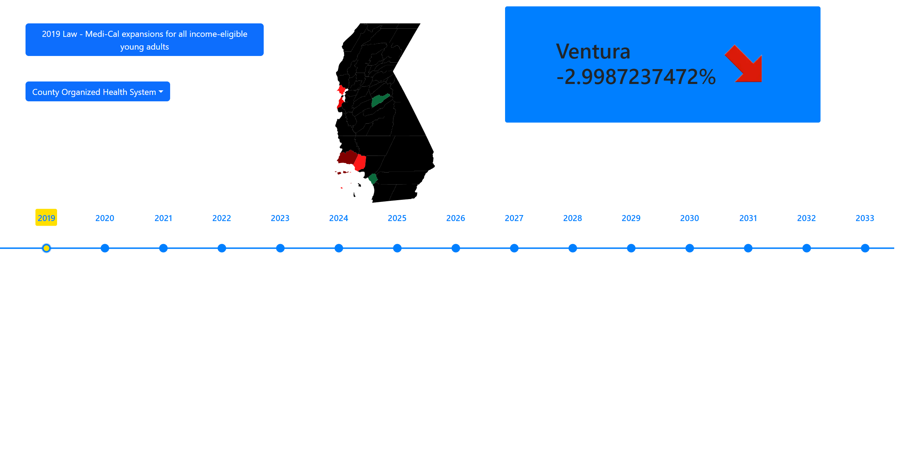

# Healthcare_Policy_Impact_Tracker

## Project Summary
- **Goal:** Analyze the impact of California healthcare policies on public health outcomes.  
- **Data:** Collected and cleaned datasets on mortality, infant mortality, and healthcare access using **Python (Pandas)**.  
- **Models:**  
  - **ARIMA** for historical policy impact analysis.  
  - **Gaussian Processes** to forecast outcomes for the next decade.  
- **Tech Stack:** Python, Next.js, React, Google Colab, Node.js, Bootstrap.  
- **Deliverables:**  
  - Interactive **web app** visualizing trends for policymakers and the public.  
  - Automated analysis pipeline for dataset cleaning, modeling, and visualization.  
- **Key Skills Gained:** Data science, machine learning, time-series forecasting, full-stack development, and model evaluation.
## Data_filtering Notebook

### How to Run

Open notebook in the data_cleaning folder and open the data_filtering.ipynb notebook
in google colab.
Then upload datasets found in the original-datasets folder in the same data_cleaning folder.
Then click on run all cells to produce the resulting cleaned datasets.

## Interrupted_time_series_analysis Notebook

### How to Run

Open notebook in the interrupted-time-series-analysis folder and open the interrupted_time_series_analysis.ipynb notebook
in google colab.
Then upload datasets found in the datasets folder in the same interrupted-time-series-analysis folder.
Then click on run all cells to produce the resulting data and charts.

## Data-visualization Notebook

### How to Run

Open notebook in the data-visualization folder and open the data-visualization.ipynb notebook
in google colab.
Then upload datasets found in the datasets folder in the same data-visualizations folder.
Then click on run all cells to produce the resulting data and charts.

## Front-end Web App of Interactive Diagram

### Prerequistes

Install the Node.js software.

### How to Run

Change directory to frontend-next-webapp\my-app. Then run the npm install and npm run dev commands. Then go to localhost:3000 and explore the interactive diagram.

### How to Visit
Go to https://healthcare-policy-impact-tracker-3partlbri-sumukh-ps-projects.vercel.app/

### Screens & Demo

## Figma Designs

### How to Find

All the various Figma designs are contained in the figma-designs folder.

